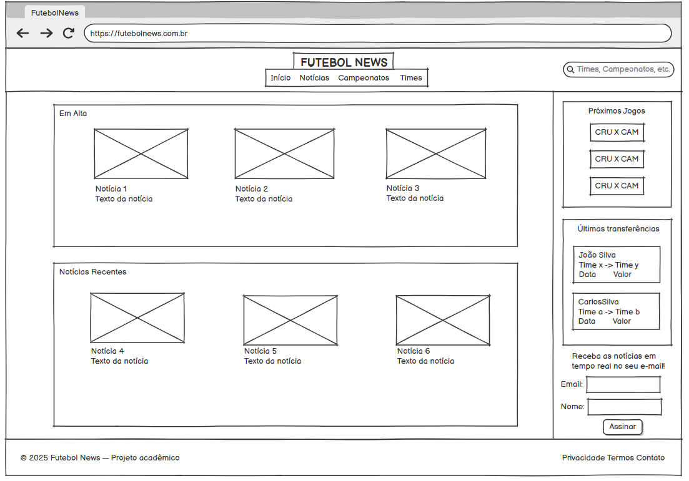
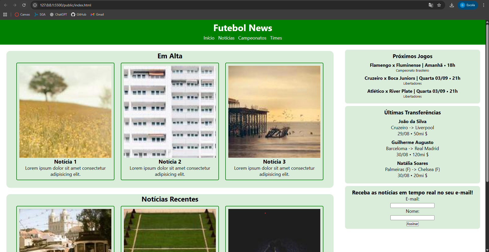

# Trabalho Prático - Semana 03

Dessa vez, vamos escolher uma proposta de projeto para trabalhar.

Nessa atividade, você deverá montar a página inicial do projeto escolhido, a organização do HTML aplicando semântica correta e uso aprimorado do CSS. Leia o enunciado completo no Canvas para mais detalhes.

**IMPORTANTE:** Você deve trabalhar e alterar apenas arquivos dentro da pasta **`public`**. Deixe todos os demais arquivos e pastas desse repositório inalterados. **PRESTE MUITA ATENÇÃO NISSO.**

## Informações Gerais

- Nome: Guilherme Augusto Martins de Carvalho
- Matricula: 903025
- Proposta de projeto escolhida: Temas e Conteúdos Associados (Entidade Principal (Tema): Futebol | Entidade Secundária (Conteúdos/Recursos): Notícias, jogos, tabela de classificação transferências, etc.)
- Breve descrição sobre seu projeto: Portal de notícias e informações sobre futebol brasileiro e mundial (Futebol News)

## Print do(s) wireframe(s) criado

## Print da home-page criada

